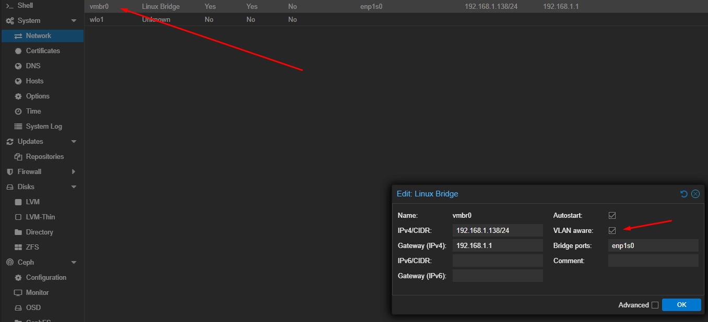

# Proxmox Installation

## Step 1 - Download latest proxmox ISO
[Download LINK](https://proxmox.com/en/downloads)

## Step 2 - Make BOOTUSB device with the downloaded ISO of proxmox
[Download RUFUS Portable](https://rufus.ie/es/)

## Step 3 - Follow Proxmox Installation steps
### Step 3.1 - Set valid FQDN(important in the future), password (for root user), mail (to receive alerts)
[Examples how to define personalized FQDN](https://www.cloudns.net/blog/fqdn-fully-qualified-domain-name/)

As a **[hostname].[domain].[tld]**

### Step 3.2 - Select networking interface (eth or wrlss)

NOTE: The shown IPs such as 192.168.100.X are initial basic configured IPs from /etc/network/interfaces on the next steps we change the network configuration.

# Proxmox Initial Setup (Before I do anything on Proxmox, I do this first...)
## 1# Network basic configuration

(This asuming you have your PROXMOX server connected to the router directly / via WiFi)

1.1.- Verify what interfaces you own, and which is the base configuration.

`ip a`

(We can see that it uses some random IP 192.168.100.2, not from within our home network which usually is 192.168.x.x/24)
(Therefore what we need to do here, is to modify the IP, taking one within the correct range of our home LAN Internet range, you can access to your router website to verify this)

For example mine was 192.168.1.128 -> 192.168.1.249.

1.2.- We must request a lease, this way the router selects, a new IP from our DHCP server at home with the following command:
`dhclient enp0s1 #Make sure you use your Iface ID`

`ip a` # to see your new IP

1.3.- Modify `/etc/network/interfaces` according to your IP and MASK

Example:

```sh
# /etc/network/interfaces

root@proxmonster:~# cat /etc/network/interfaces
auto lo
iface lo inet loopback

iface enp1s0 inet manual

auto vmbr0
iface vmbr0 inet static
        address 192.168.1.138/24
        gateway 192.168.1.1
        netmask 255.255.255.0
        nameserver 8.8.8.8
        nameserver 8.8.4.4
        nameserver 1.1.1.1
        bridge-ports enp1s0
        bridge-stp off
        bridge-fd 0

iface wlo1 inet manual

source /etc/network/interfaces.d/*
root@proxmonster:~#
```

1.4.- Activate IP forwarding

`echo 1 > /proc/sys/net/ipv4/ip_forward`

```
IP Forwarding: IP forwarding is the ability of a Linux system to route packets between network interfaces. By default, Linux systems do not forward packets between interfaces, which means they only process packets destined for their own IP addresses.
```

1.5.- Restart the service networking
`service networking restart`

1.6.- Edit `/etc/hosts/` file

Adding new IP as your new hostname.

Example:
```sh
root@proxmonster:~# cat /etc/hosts
127.0.0.1 localhost.localdomain localhost
#192.168.100.2 proxmonster.rohenslab.xyz proxmonster
192.168.1.138 proxmonster.rohenslab.xyz proxmonster

# The following lines are desirable for IPv6 capable hosts

::1     ip6-localhost ip6-loopback
fe00::0 ip6-localnet
ff00::0 ip6-mcastprefix
ff02::1 ip6-allnodes
ff02::2 ip6-allrouters
ff02::3 ip6-allhosts
root@proxmonster:~#
```

1.7.- Verification step
`ip a` verify that the IPs haven't been removed, your defined IP is there and stable, finally ping `8.8.8.8` or `google.com`


## 2# Update proxmox without a subscription

2.1.- Edit `/etc/apt/sources.list` add these comented lines: 

```sh
# /etc/apt/sources.list                                             

deb http://ftp.es.debian.org/debian bookworm main contrib

deb http://ftp.es.debian.org/debian bookworm-updates main contrib

# security updates
deb http://security.debian.org bookworm-security main contrib

# not for production use
deb http://download.proxmox.com/debian bookworm pve-no-subscription

# bookworm pbs-no-sub
deb http://download.proxmox.com/debian/pbs bookworm pbstest
```
  


2.2.- To avoid errors when updating comment the following line: 
`#deb https://enterprise.proxmox.com/debian/pve bookworm pve-enterprise`

in the file `/etc/apt/sources.list.d/pve-enterprise.list`

root@proxmonster:~# cat /etc/apt/sources.list.d/pve-enterprise.list

#deb https://enterprise.proxmox.com/debian/pve bookworm pve-enterprise
root@proxmonster:~#

2.3.- Comment one more line at `/etc/apt/sources.list.d/ceph.list`

```
# deb https://enterprise.proxmox.com/debian/ceph-quincy bookworm enterprise
```

2.4.- apt-get update and apt dist-upgrade

## 3# Config storage new disks or for RAID, pass.

## 4# Enable SMART checks with command smartctl -a /dev/sda1

## 5# Enable IOMMU

`nano /etc/default/grub`
Comment line and add the below one, `AMD` `Intel` processor.
```
#GRUB_CMDLINE_LINUX_DEFAULT="quiet"
GRUB_CMDLINE_LINUX_DEFAULT="quiet intel_iommu=on"
#GRUB_CMDLINE_LINUX_DEFAULT="quiet amd_iommu=on"
```

`Save it`

`uptate-grub`

`nano /etc/modules`

```sh
# /etc/modules: kernel modules to load at boot time.
#
# This file contains the names of kernel modules that should be loaded
# at boot time, one per line. Lines beginning with "#" are ignored.
# Parameters can be specified after the module name.

vfio
vfio_iommu_type1
vfio_pci
vfio_virqfd
```

## 6# VLAN Aware



# Cluster setup and installation
## 1# Installing kubeadm

`testing ---`