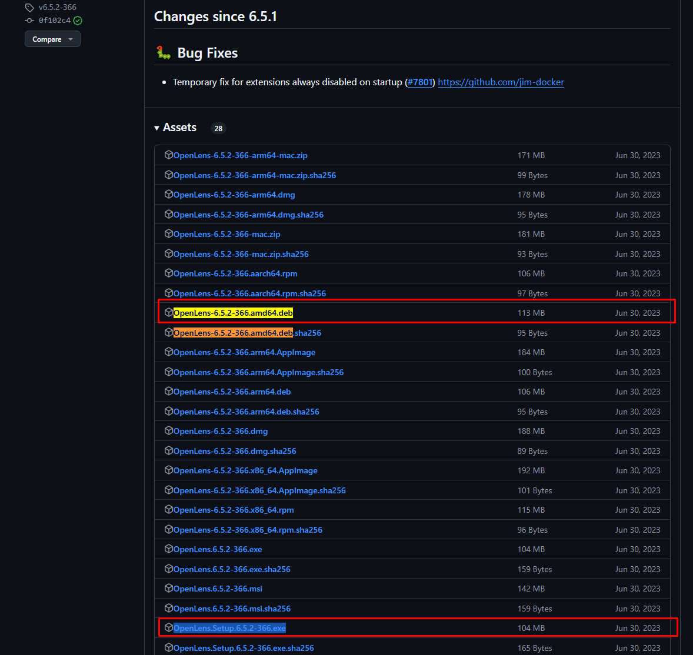
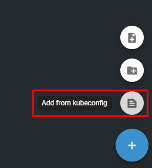
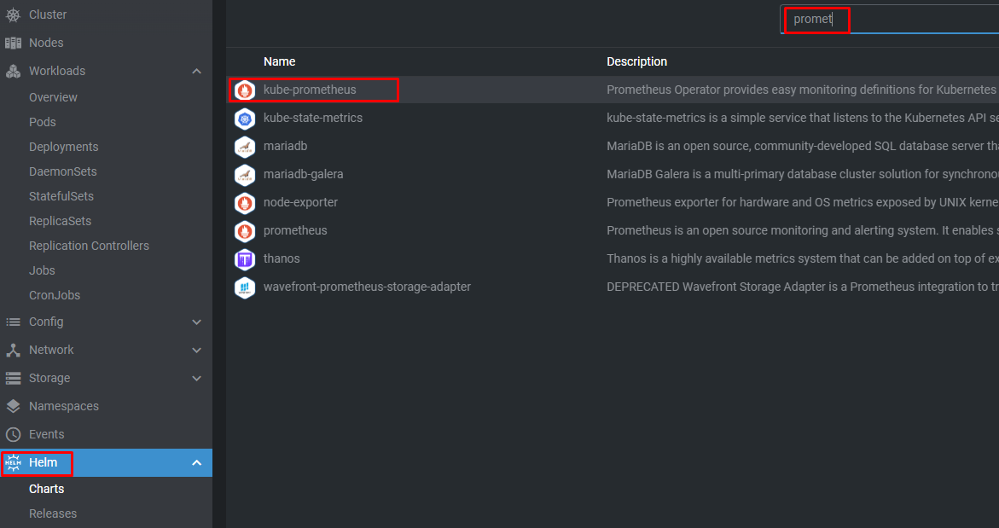
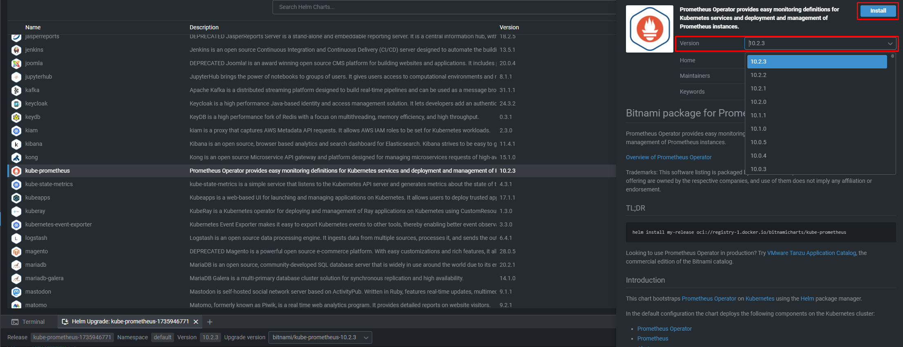
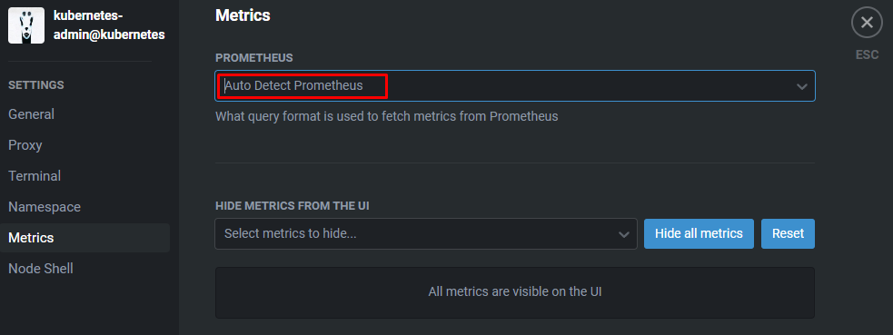

# Lens Installation
## Description
Lens is an Integrated Development Environment (IDE) designed to simplify and enhance the experience of working with Kubernetes clusters, also it can be very useful as a "_portable_" tool to manage clusters. Basically it provides flexibility to manage clusters, visualize the resources, interactive user interface, customization and extensibility, real-time monitoring.

> Official Lens Website [**here**](https://docs.k8slens.dev/getting-started/install-lens/#__tabbed_1_1) 

> Download MuhammedKalkan/OpenLens/releases  [**here**](https://github.com/MuhammedKalkan/OpenLens/releases)

___
## Installation

> [!NOTE]
> Don't worry you don't need to install anything on your cluster host machine, only intallation in your workspace machine. 

- Access to [**MuhammedKalkan/OpenLens/releases**](https://github.com/MuhammedKalkan/OpenLens/releases), depending on your OS, you must select the installation file.

<div align="center">
  
</div>


## Adding the cluster

- 1.- From the Home page, go to `Browse Clusters in Catalog`.

<div align="center">
  
</div>

- 2.- Now you have multiple options to connect your cluster, in the `+` icon, if you have the cluster on-premises / home lab as in my use case I must import the `.kube/config` file to connect my cluster to Lens `Add from kubeconfig`

<div align="center">
  
</div>

- 3.- Copy the content from `~/.kube/config` `master` cluster host machine and paste it here.

<div align="center">
  
</div>

___
## Enabling Metrics
### Prerequisites
 
- Helm
- Prometheus

>[!NOTE]
> - Helm - [Methods to Install Helm based on your OS](https://helm.sh/docs/intro/install/)


### Installing Helm

```
sudo su
```

```
curl https://baltocdn.com/helm/signing.asc | gpg --dearmor | sudo tee /usr/share/keyrings/helm.gpg > /dev/null

sudo apt-get install apt-transport-https --yes
 
echo "deb [arch=$(dpkg --print-architecture) signed-by=/usr/share/keyrings/helm.gpg] https://baltocdn.com/helm/stable/debian/ all main" | sudo tee /etc/apt/sources.list.d/helm-stable-debian.list
 
sudo apt-get update

sudo apt-get install helm
```

### Installing Prometheus

- We'll install `Prometheus` monitoring via `Helm Charts` follow the steps below, search for `kube-prometheus` chart.

<div align="center">
  
</div>

- Select the version and `Install`.

<div align="center">
  
</div>

- Access to `Lens > Cluster Settings > Metrics` select `Auto Detect Prometeus` in the drop down menu. Enjoy ;)

<div align="center">
  
</div>

>[!NOTE]
>If you face any issues or need additional options for Lens cluster monitoring, check the [**official docu**](https://docs.k8slens.dev/cluster/cluster-metrics/?h=metrics#__tabbed_1_1).
