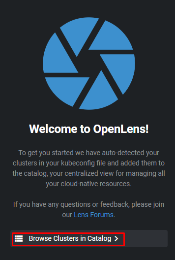
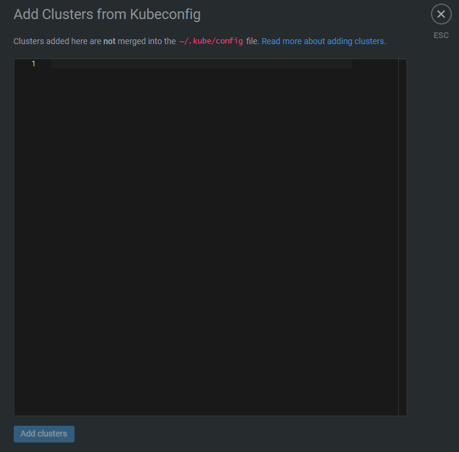

# Lens Installation
## Description
Lens is an Integrated Development Environment (IDE) designed to simplify and enhance the experience of working with Kubernetes clusters, also it can be very useful as a "_portable_" tool to manage clusters. Basically it provides flexibility to manage clusters, visualize the resources, interactive user interface, customization and extensibility, real-time monitoring.

> Official Lens Website [**here**](https://docs.k8slens.dev/getting-started/install-lens/#__tabbed_1_1) 

> Download MuhammedKalkan/OpenLens/releases  [**here**](https://github.com/MuhammedKalkan/OpenLens/releases)

___
## Installation

> [!NOTE]
> Don't worry you don't need to install anything on your cluster host machine, only intallation in your workspace machine. 

- Access to [**MuhammedKalkan/OpenLens/releases**](https://github.com/MuhammedKalkan/OpenLens/releases), depending on your OS, you must select the installation file.


## Adding the cluster

- 1.- From the Home page, go to `Browse Clusters in Catalog`.



- 2.- Now you have multiple options to connect your cluster, in the `+` icon, if you have the cluster on-premises / home lab as in my use case I must import the `.kube/config` file to connect my cluster to Lens `Add from kubeconfig`


- 3.- Copy the content from `~/.kube/config` `master` cluster host machine and paste it here:



___
## Enabling Metrics
### Prerequisites
 
```
- Helm
```

