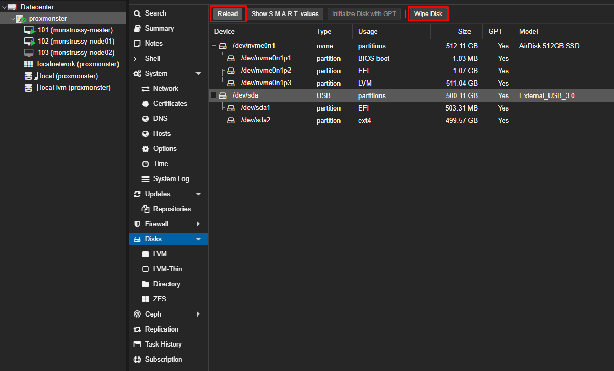
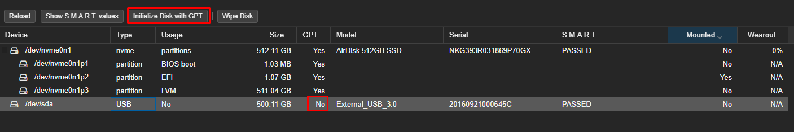

# Proxmox - NFSnas

- Access to `proxmox node > disks`.
- Attach the `new disk` to proxmox hardware, in my case is an external USB HD.
- Press `Reload` select your new disk, `my /dev/sda` and `Wipe Disk`.

<br>


<div align="center">
  
</div>

<br>

- Initialize Disk with `GPT` after will appear `YES`, and will be visible when managing storage.

<br>

<div align="center">
  
</div>

<br>


- Go to Directory create new `Directory`. And it will appear in our left panel once the directory is Created.
- Created VM unter this dir
- Inside of the VM we will configure nfs-kernel-server, see the following part.
___
# NFS-Kernel-Server setup (Ubuntu server VM)

```shell

sudo apt update
sudo apt install nfs-kernel-server
sudo apt install nfs-common
```
___
## Creating the Share Directories on the Host

```shell

mkdir /var/nfs/general -p
ls -la /var/nfs/general
chown nobody:nogroup /var/nfs/general

```
___
## Configuring the NFS Exports on the Host Server

```shell

nano /etc/exports
```

```shell

# /etc/exports
/var/nfs/general 192.168.1.0/24(rw,sync,no_subtree_check)
/var/nfs/general 192.168.0.0/18(rw,sync,no_subtree_check)
```

```shell

systemctl restart nfs-kernel-server
```

## Adjusting the Firewall on the Host

___

## Creating Mount Points and Mounting Directories on the Client

```shell

apt-get install nfs-common

sudo mount NFSSERVER_IP:/var/nfs/general /home/rohen/nfs/general


```

>[!Note]
> Can use the -o nconnect=n flag when mounting NFS share from the client to boost IOPS for certain workloads. Where “n” is the number of connections to establish between this client and the target NFS Server. The number can be from 1 to 16.

`FROM: https://www.digitalocean.com/community/tutorials/how-to-set-up-an-nfs-mount-on-ubuntu-20-04#step-4-adjusting-the-firewall-on-the-host
`


```shell

MOCK STEPS:

Set Up NFS Mount
To set up an NFS mount using nfs-kernel-server, follow these steps:

Install NFS Packages: On the server (host) and client machines, install the necessary NFS packages. On Ubuntu or Debian, use the following commands:
On the server (host):
sudo apt-get update
sudo apt-get install nfs-kernel-server

On the client:
sudo apt-get update
sudo apt-get install nfs-common

Create Export Directory: On the server, create the directory you want to share:
sudo mkdir -p /var/nfs/general

Configure NFS Exports: Edit the /etc/exports file to specify which directories should be shared and with whom. For example:
/var/nfs/general client_ip(rw,sync,no_subtree_check)

Replace client_ip with the IP address of the client machine.
Restart NFS Services: After configuring the exports, restart the NFS services to apply the changes:
sudo exportfs -a
sudo systemctl restart nfs-kernel-server

Adjust Firewall: Ensure that the firewall allows NFS traffic. On Ubuntu, you can allow NFS traffic with:
sudo ufw allow from client_ip to any port nfs

Mount NFS Share on Client: On the client machine, create a mount point and mount the NFS share:
sudo mkdir -p /mnt/nfs/general
sudo mount host_ip:/var/nfs/general /mnt/nfs/general

Replace host_ip with the IP address of the server.
Automount NFS Share: To mount the NFS share automatically at boot, add an entry to the /etc/fstab file on the client:
host_ip:/var/nfs/general /mnt/nfs/general nfs auto,nofail,noatime,nolock,intr,tcp,actimeo=1800 0 0

Verify Mount: Check if the NFS share is mounted correctly using:
df -h

This setup allows you to share directories between a server and a client using NFS.


```